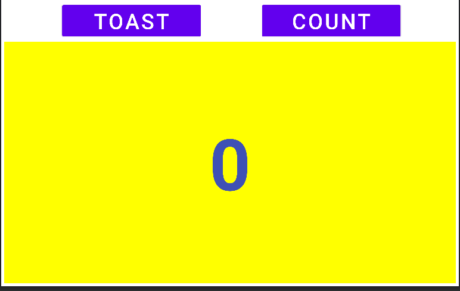
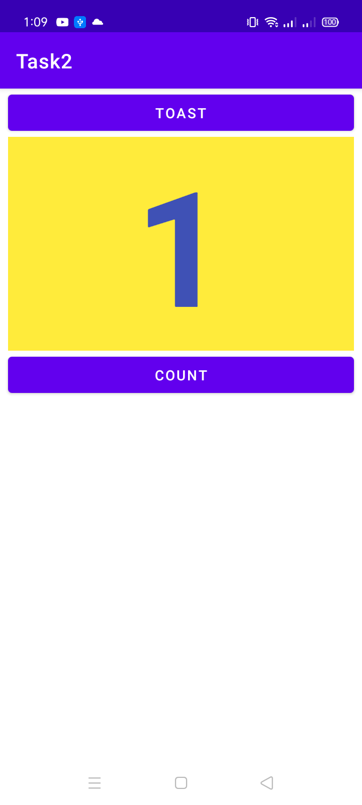
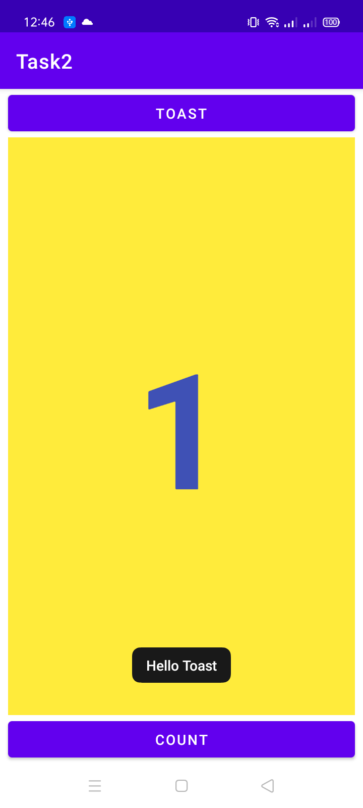
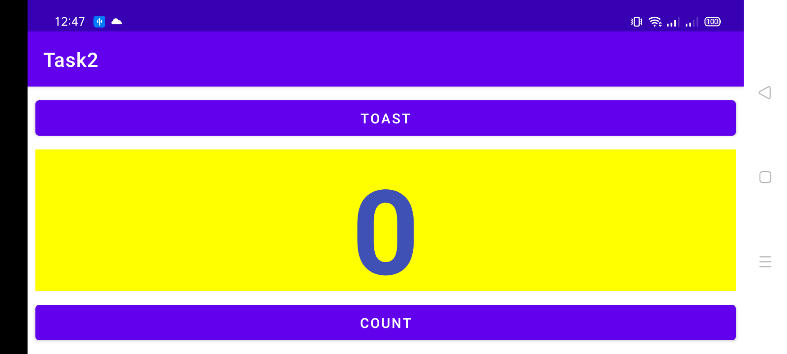
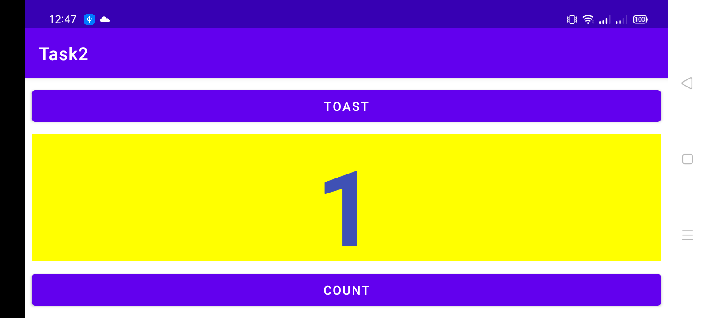
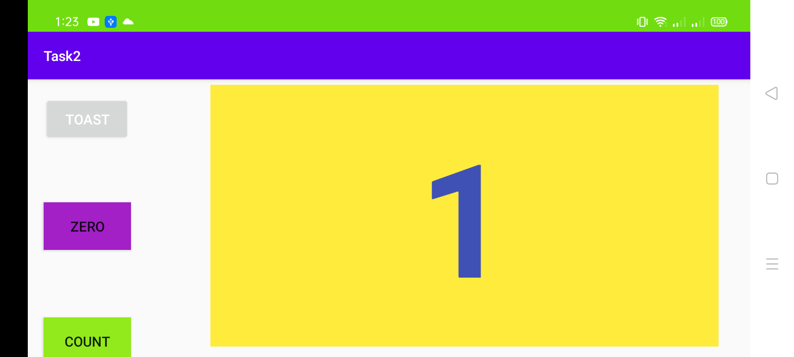
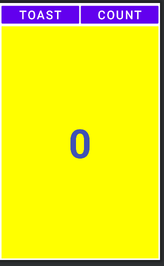

##Lab 2 Homework

### toast , zero , count button is displayed

**This is the interface of the app when the app starts**

**when count button clicked the number increases and the colour of the button turns green**

**when toast button is clicked the hello toast message is appeared**

**when Zero button is clicked then olny 0 appeared and the colour of the button turns grey**

