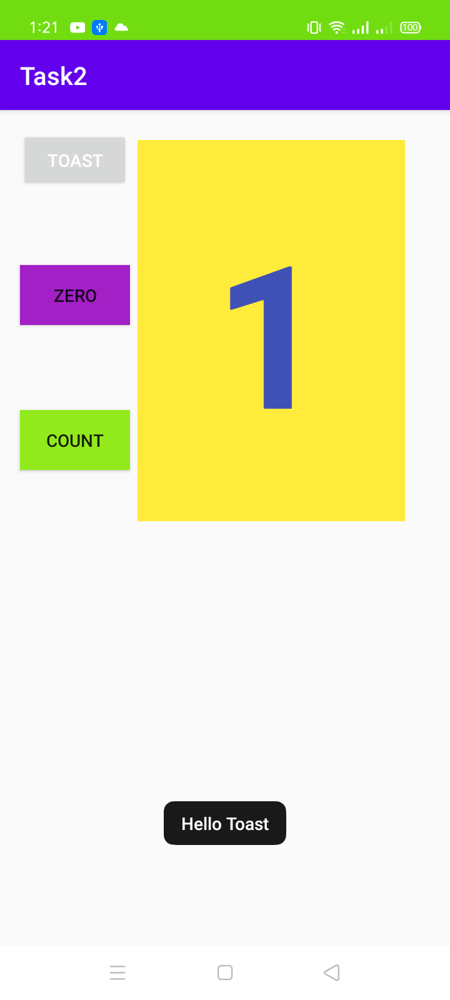
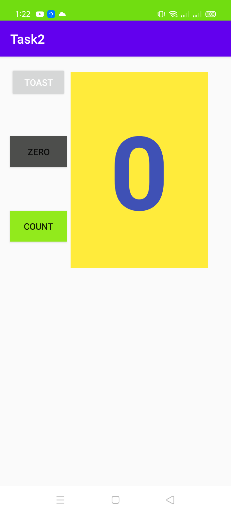
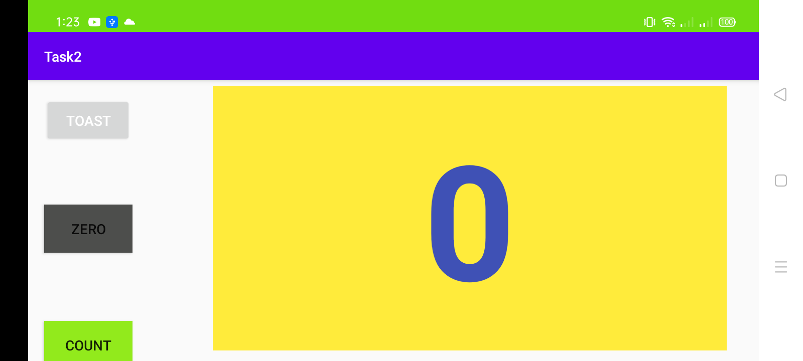

## Lab 2 Task

### Hello Toast app in different layout
#### This is in general mode

**This is the interface of the app when the app starts**

**When the count button is clicked the number increases**

**hello toast message appears when toast button is clicked**

#### This is in Landscape mode

**This is the interface of the app when the app starts**

**When the count button is clicked the number increases**

**hello toast message appears when toast button is clicked**

#### This is in Tablet mode

**This is the interface of the app when the app starts**

---