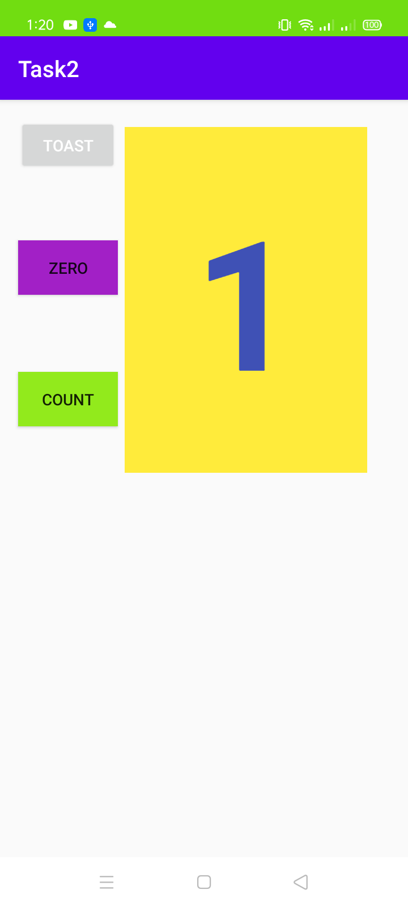

##Lab 2 task 3 Relative layout

### Task 2 in which Relative layout is displayed

**This is the interface of the app when the app starts**

**when count button clicked the number increases**

**when toast button is clicked the hello toast message is appeared**